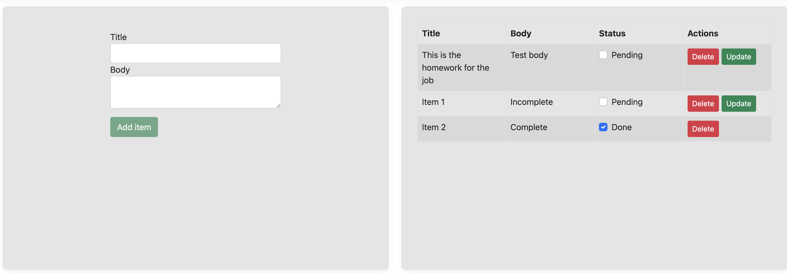

# TODOList
Here is the project.
The design is very basic. I stuck to the described homework. Since unit tests were not mentioned as a requirement, I haven't added them. This is due to the fact that the whole project is a simple CRUD project. If necessary, could add unit tests to make sure that the LINQ query inside GetAll sorts the list correctly.

You should be able to run it by doing "dotnet run" and going to http://localhost:5192